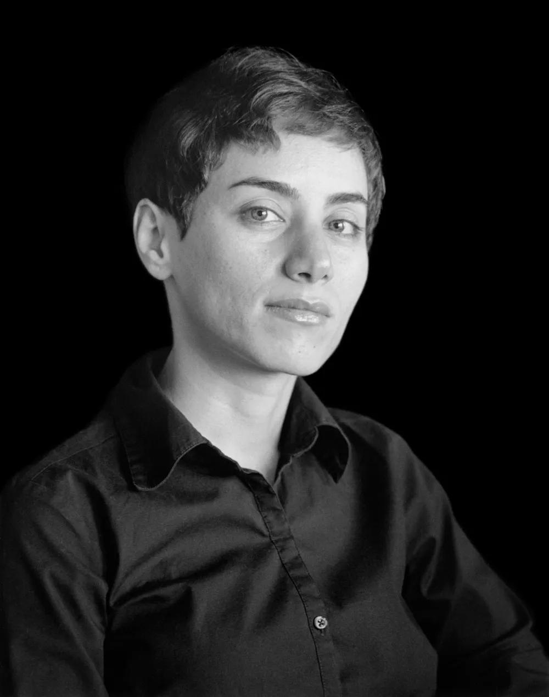

    

    

        <!-- Title is left-aligned -->
        

            Maryam Mirzakhani:  Mathematical Pioneer
        

        

            Maryam Mirzakhani (1977–2017) was an Iranian mathematician known for her groundbreaking work in the fields 
            of geometry and dynamical systems. She made history as the first woman to win the 
            <strong>Fields Medal</strong>, the most prestigious award in mathematics. Her research focused on the 
            dynamics and geometry of Riemann surfaces and their moduli spaces, making significant contributions 
            to hyperbolic geometry, Teichmüller theory, and ergodic theory. Her insights reshaped the field 
            and inspired a new generation of mathematicians.
        

    

  

## Early Life & Education

- Born on **May 12, 1977**, in **Tehran, Iran**.
- Displayed an early talent for mathematics and attended the **Farzanegan School**, part of Iran’s National Organization for Development of Exceptional Talents (NODET).
- Won **gold medals** in the International Mathematical Olympiad (1994 and 1995), achieving a perfect score in 1995.
- Earned her **BSc in Mathematics** from **Sharif University of Technology** in Tehran.
- Completed her **Ph.D. at Harvard University** (2004), under the supervision of **Curtis McMullen**.

## Academic Achievements

Mirzakhani's research focused on:

- **Hyperbolic Geometry**: The study of curved surfaces.
- **Teichmüller Theory**: A branch of complex analysis related to the geometry of surfaces.
- **Ergodic Theory & Moduli Spaces**: The mathematical structures that describe deformations of surfaces.

Her **Fields Medal-winning work (2014)** involved the dynamics of simple closed geodesics (loops) on hyperbolic surfaces, significantly advancing understanding in topology and geometry.

## Career & Legacy

- Became a **professor at Princeton University** (2004-2008) and later at **Stanford University** (2008-2017).
- Inspired countless women in STEM as the first **female Fields Medalist**.
- Passed away on **July 14, 2017**, after a battle with breast cancer.

## Recognition & Influence

- In 2014, became the **first woman and first Iranian** to receive the **Fields Medal**.
- Honored by multiple institutions and organizations worldwide for her contributions to mathematics.
- Iran declared **July 14 as 'Maryam Mirzakhani Day'** to honor her legacy and inspire women in STEM fields.

## Quotes

> "The beauty of mathematics only shows itself to more patient followers."
